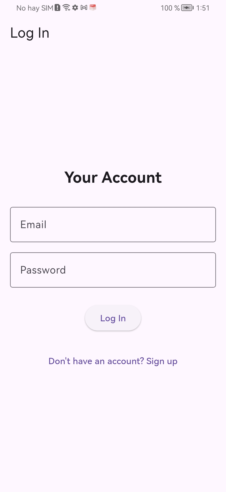
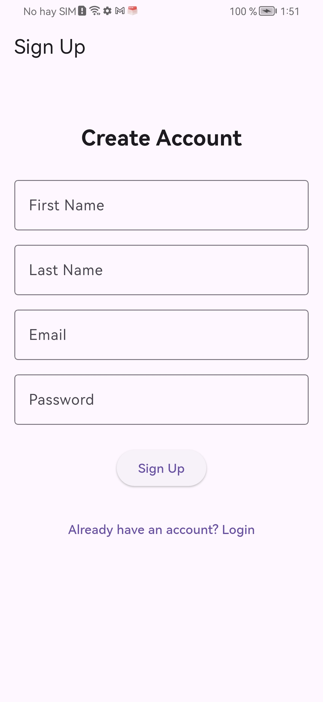
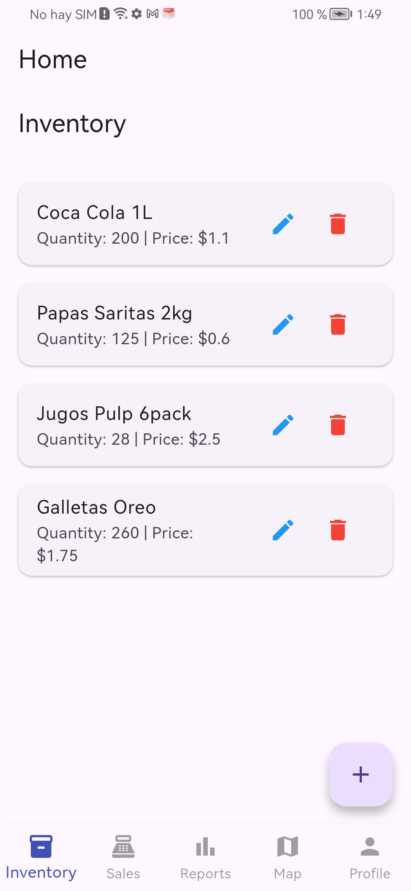
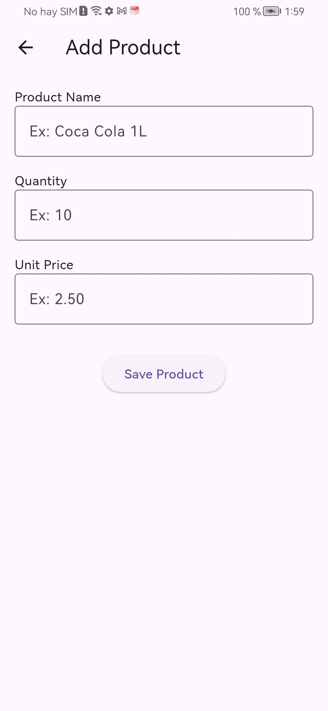
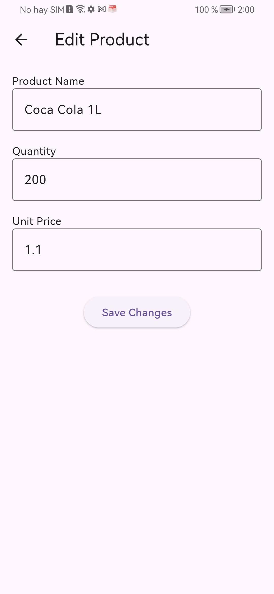
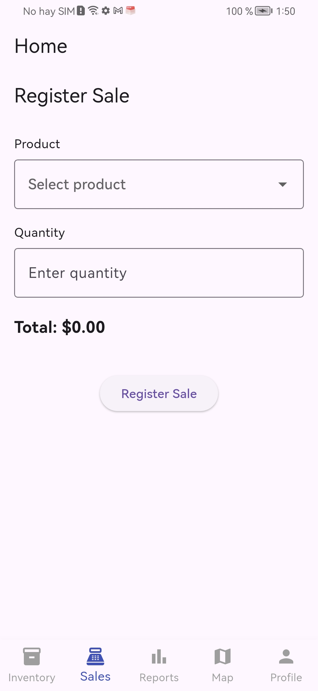
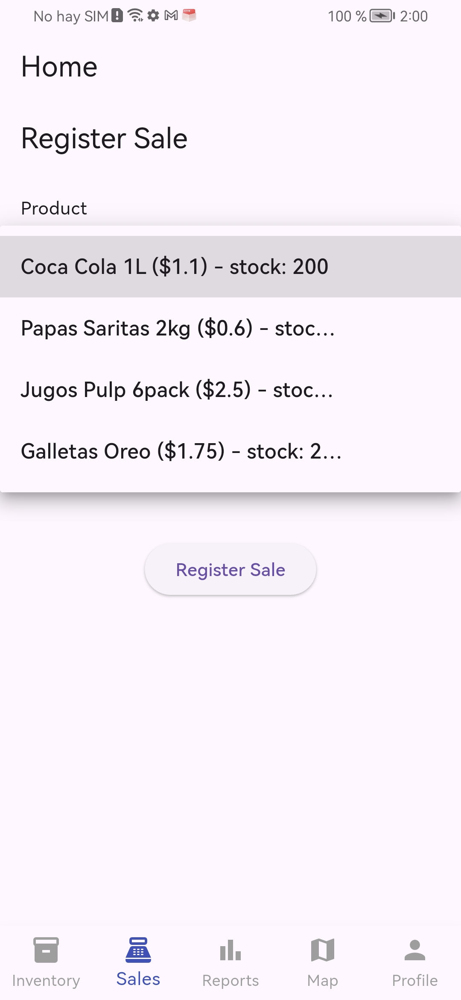
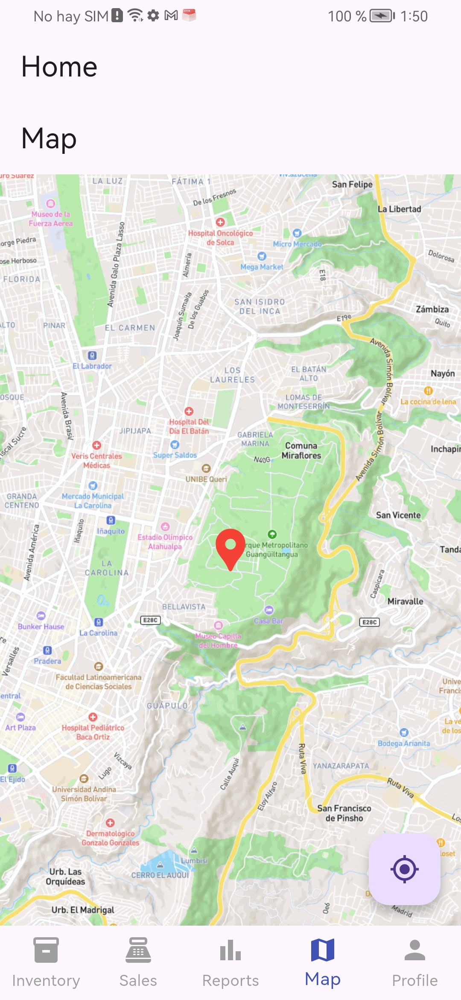
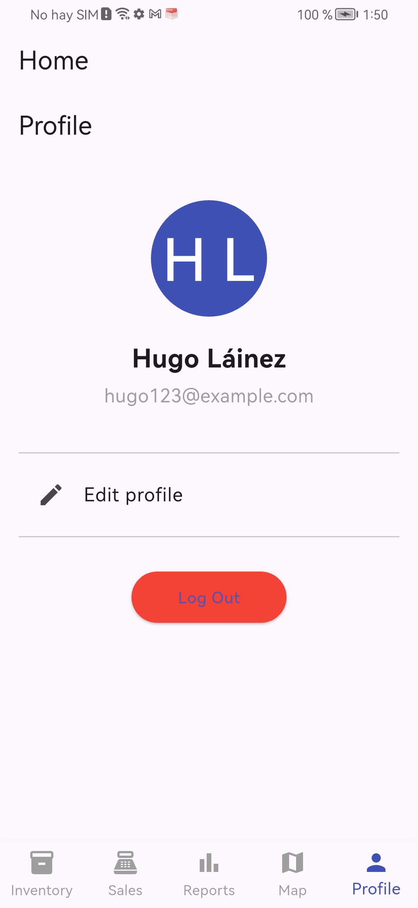

# 📱 Inventory & Sales App

Proyecto desarrollado como parte de un módulo académico enfocado en el aprendizaje del desarrollo móvil en Android con Flutter- Universidad UTE

---

## 📘 Descripción General

Esta es una aplicación móvil desarrollada en Flutter, orientada a la gestión de inventario, ventas y reportes. Incluye autenticación, almacenamiento local con SQLite y notificaciones internas.
El objetivo principal es simular un sistema sencillo pero funcional para manejo de productos y control de ventas.

---

## 🛠 Tecnologías Utilizadas

- **Flutter 3.x**
- **Dart**
- **SQLite (sqflite)** – almacenamiento local
- **SharedPreferences** – manejo de sesión
- **Mapbox + flutter_map** – mapa estático
- **flutter_local_notifications** – notificaciones locales

---

## 📂 Estructura del Proyecto

```bash 
lib/
 ├── main.dart
 ├── screens/
 │    ├── auth
 |    |    ├── login_screen.dart
 |    |    └── signup_screen.dart
 |    ├── inventory
 |    |    ├── add_product_screen.dart
 |    |    └── edit_product_screen.dart
 │    ├── home_screen.dart
 │    ├── inventory_screen.dart
 │    ├── sales_screen.dart
 │    ├── reports_screen.dart
 │    ├── profile_screen.dart
 │    ├── edit_profile_screen.dart
 │    └── map_screen.dart
 └── services/
      ├── db_service.dart
      └── notification_service.dart

```

---

## 🔐 Autenticación

- Registro de usuarios con SQLite
- Login validado con base de datos
- Sesión persistente mediante SharedPreferences
- Cierre de sesión desde el módulo de perfil


---

## 📦 Inventario

- CRUD completo de productos
- Campos: nombre, cantidad, precio
- Los datos se guardan en SQLite
- Interfaz intuitiva para editar o eliminar productos

---

## 💰 Ventas

- Selección de productos desde inventario
- Registro de venta con cantidad y total automático
- Reducción automática de stock
- Validaciones para evitar ventas incorrectas
- Guardado en tabla sales

---

## 📊 Reportes

- Resumen superior:
    - Total vendido
    - Total del día
    - Cantidad de ventas

- Lista detallada de ventas (producto, cantidad, total, fecha)

---

## 🗺 Mapa

- Implementado con Mapbox
- Muestra la ubicacion en tiempo real
- Incluye botón para centrar la vista
- No requiere claves avanzadas

---

## 🔔 Notificaciones Locales

- Se envía alerta cuando un producto queda con menos de 10 unidades
- Funciona inmediatamente después de registrar una venta

---

## ▶️ Cómo Instalar y Ejecutar el Proyecto

1. Clonar este repositorio
    ```bash
    git clone https://github.com/hugooisraell/inventory_app


2. Abrir el proyecto en VSCode

3. Instalar dependencias:
    ```bash
    flutter pub get


4. Asegurarse de tener:
    - Emulador configurado
    - O un dispositivo físico con modo desarrollador


5. Ejecutar:
    ```bash
    flutter run

---

## 📑 Notas Importantes para el Docente

- El proyecto es completamente funcional sin uso de servidores externos.
- Toda la lógica está implementada de manera local (ideal para entornos académicos).
- El código está documentado con comentarios en español.
- Los nombres de las clases, archivos y variables están en inglés siguiendo buenas prácticas de Flutter.
- Se priorizó una arquitectura simple y entendible para evaluación y mantenimiento.

---

## 📸 Capturas de pantalla

- Login

- Signup

- Home
- Inventory

- Add Product

- Edit Product

- Sales


- Reports

- Map

- Profile

- Edit Profile


---

## 👨‍🎓 Estudiante

- **Hugo Láinez**
- Aplicaciones Móviles
